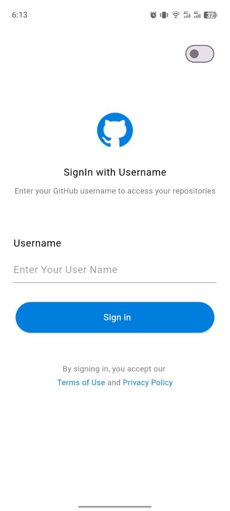

# GitView Assignment

## Description
A Flutter app to view GitHub user profiles and repositories.

## How to Use
1. Install the app on your device.
2. Login with GitHub username & use Switch button for Light Theme to Dark Theme.
3. View profile and repositories.
4. Search repositories.
5. Tap a repository to see details. 
6. Tap the button to the right side of "You Repository" Switch Listview to Gridview.
7. Logout.

## Features
- Profile view
- Repository list/grid toggle
- Repository search/filter
- Repository details page

## Development Criteria
- Flutter 3.9+
- GetX for state management
- Dio for API requests
- MVVM architecture
- Dark/Light theme support

## Screenshots
### Home Screen

### Repo Listview show with User details Screen

### Repo Gridview show with User details Screen

### Repositories details Screen

